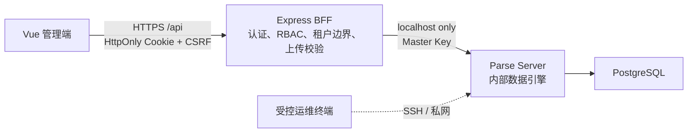

# 安全架构与运维说明

## 目标架构

浏览器不再访问 `/parse`、Parse Dashboard 或数据库；`PARSE_MASTER_KEY`、数据库 URI 和 JWT 密钥只存在于服务端 `.env`。

## 已消除的主要风险

| 原问题 | 风险 | 当前控制措施 |
| --- | --- | --- |
| 前端下发 Parse Master Key | 任意人可读取、修改、删库 | 前端改为 BFF 适配层，服务端密钥环境变量化 |
| Parse / Dashboard 暴露在公网 | 数据库管理面和 REST API 被直接攻击 | Parse 仅监听 `127.0.0.1:1337`；默认不随应用安装 Dashboard |
| 公共 ACL、客户端建表 | 越权访问、任意建表 | BFF 使用服务端 RBAC；新建类默认私有 CLP；客户端建类关闭 |
| 伪造 `companyId` / 前端按钮权限 | 跨租户读写 | 用户、公司、角色从签名会话解析；服务端覆盖租户条件 |
| 岗位页面或按钮权限仅由前端隐藏 | 直接调用接口绕过菜单、按钮限制 | 岗位管理将业务 Route 与逐页 `routePermissions` 写入受控 RBAC 记录；服务端按岗位、页面和操作二次校验，系统岗位及成员的岗位/组织字段只能通过专用接口维护 |
| 删除或绕过组织归属字段 | 跨区域越权、历史数据悬空 | 业务表可显式启用 `organization` Pointer；查询、创建、修改按成员范围与下级组织过滤，字段和被引用的组织均受服务端保护 |
| Token 放在 Web Storage | XSS 后可长期窃取会话 | HttpOnly + SameSite=Strict Cookie，变更请求需 CSRF Header |
| 首页登录统计泄露其他成员活动 | 越权观察、用户行为暴露 | 登录活动记录使用私有 CLP；`/api/dashboard/overview` 固定按 `req.auth.user` 与 `req.auth.company` 过滤，只返回当前账号的汇总 |
| 任意上传路径和文件名 | 路径穿越、任意文件写入 | 鉴权、白名单 MIME、大小上限、随机文件名、根目录校验 |
| 老旧依赖与 XLSX 导出 | 已知漏洞和供应链维护成本 | 更新运行时依赖；移除 Parse 浏览器 SDK、富文本/XLSX 依赖；CSV 导出防公式注入 |

## 首次部署

1. 备份 PostgreSQL，并立即轮换旧的数据库口令、Parse App ID / Master Key、JWT 密钥和任何曾提交的 TLS 私钥。
2. 复制 `.env.example` 为 `.env`，填入随机高强度值。建议使用独立、最小权限的 PostgreSQL 应用账号。
3. 启动 API：`npm ci && npm start`。公网只反向代理到 `3000`；不要发布 `1337`。
4. 在 API 已启动的受控终端运行一次 `npm run seed:initial`。它不再创建固定默认密码，必须提供 `INITIAL_ADMIN_*`。
5. 部署前端产物，并将 `/api` 反向代理至 API 的 `3000` 端口。开发时 `vue.config.js` 已完成该代理。
6. 验证现有记录都带有 `company` 指针后，运行 `npm run security:harden` 将已有 Parse 类的 CLP 收紧为私有。此命令需在 Parse 内部端点可达时运行。

## 运行约束

- `npm run audit:prod` 必须保持无 high / critical；CI 会执行此检查。
- Dashboard 若确有运维需要，应作为独立、短时、私网工具运行，不得挂载到业务域名。
- 富文本字段现在以纯文本编辑，避免将不可信 HTML 直接存储和回显。若业务必须恢复富文本，请先引入服务端白名单清洗和 CSP 评审。
- CSV 适用于 Excel 打开和数据交换；导出程序会转义公式前缀以防 CSV 注入。
- `LoginActivity` 是 BFF 内部统计类：在首次成功登录时按需创建，带有私有 CLP，不出现在低代码 Schema 管理页面，也不能通过通用数据 API 查询。它只保存 Company、用户指针、内部会话关联 ID 与创建时间；不保存 IP、密码或浏览器指纹。
- 此次未改写 Git 历史。已被提交过的 `ssl/*.key` / `ssl/*.pem` 必须吊销并在确认协作影响后用仓库历史清理流程移除。
